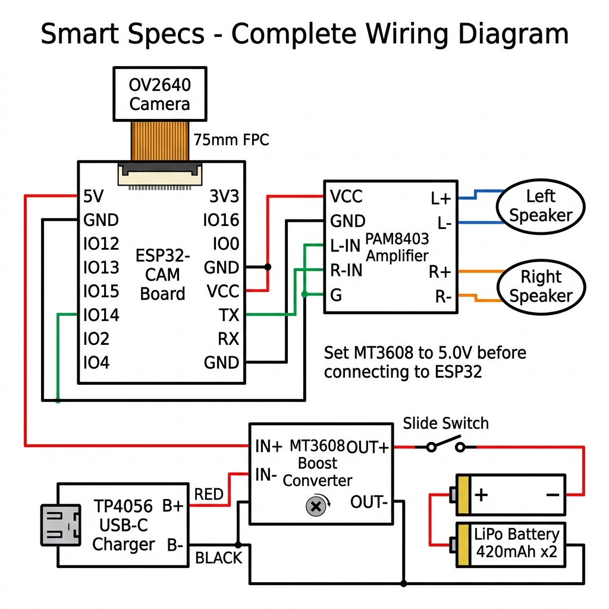
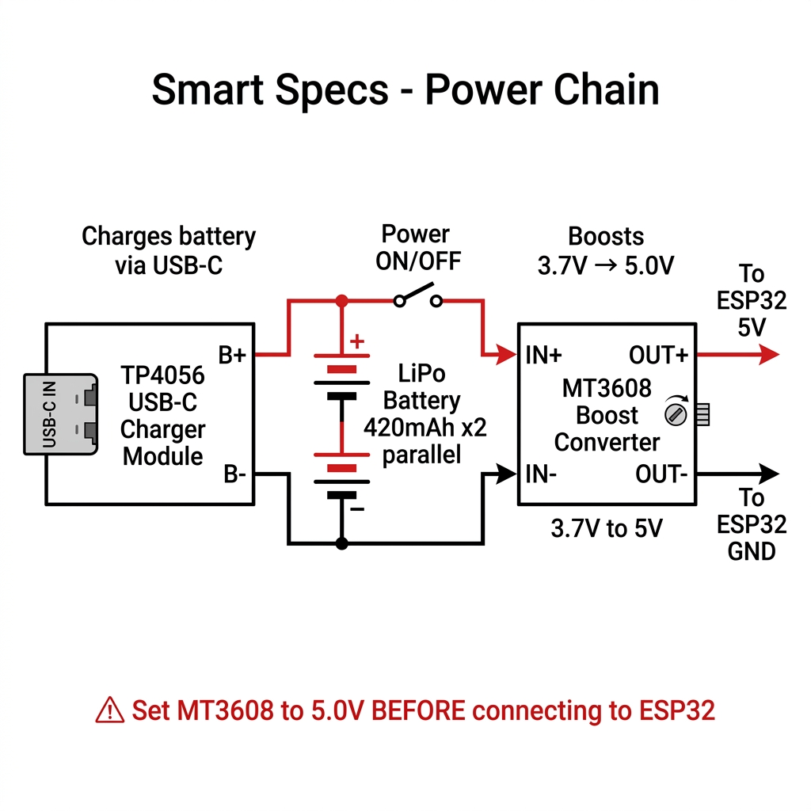

# Smart Specs — Hardware Wiring & Power Guide

## System Circuit Overview
The Smart Specs system connects an ESP32-CAM (with OV2640 camera), dual speakers driven by a PAM8403 amplifier, and a battery power subsystem with charging and voltage boost.



---

## Power Subsystem Chain

The power chain steps up the 3.7V LiPo voltage to a stable 5.0V using an MT3608 boost converter:

```
[TP4056 USB-C] ---> [LiPo Battery (3.7V)] ---> [Slide Switch] ---> [MT3608 Boost] ---> 5.0V to ESP32 & PAM8403
```



> **IMPORTANT:** Always calibrate the MT3608 trimpot screw to output **exactly 5.0V** with a multimeter before connecting to the ESP32-CAM 5V pin!

---

## Pin Connection Reference

### 1. Power Supply
| Source Pin | Destination Pin | Description |
|---|---|---|
| TP4056 B+ | Battery (+) & MT3608 IN+ | Battery charging & power input |
| TP4056 B- | Battery (-) & MT3608 IN- | Common battery ground |
| MT3608 OUT+ | ESP32-CAM 5V & PAM8403 VCC | Regulated 5.0V power rail |
| MT3608 OUT- | ESP32-CAM GND & PAM8403 GND | Common ground |

### 2. Audio Subsystem
| ESP32 Pin | PAM8403 Pin | Speaker |
|---|---|---|
| GPIO14 | L-IN & R-IN | Mono sigma-delta audio signal |
| GND | G (Audio Ground) | Audio reference ground |
| - | L+ / L- | Left Speaker (8Ω 1W) |
| - | R+ / R- | Right Speaker (8Ω 1W) |

### 3. Camera
- OV2640 2MP Camera module connected via 75mm 24-pin FPC ribbon cable directly to the ESP32-CAM FPC connector (gold contacts facing downward).
